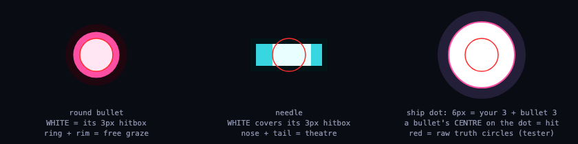
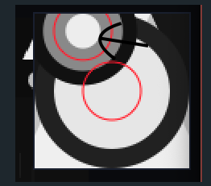
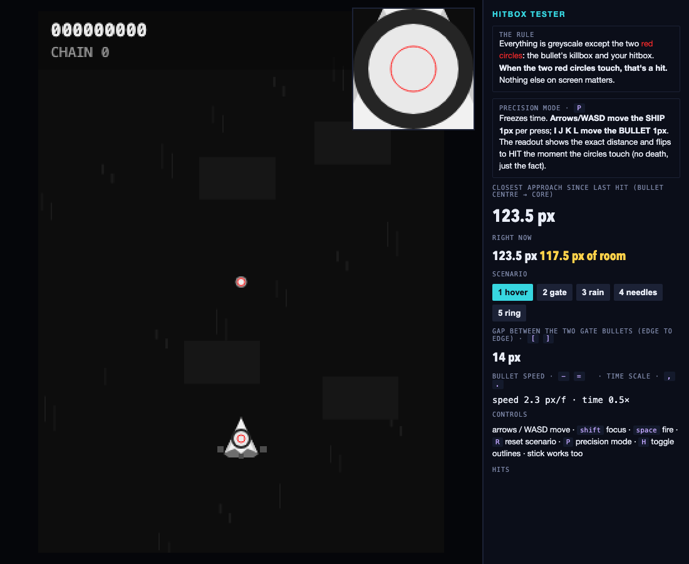
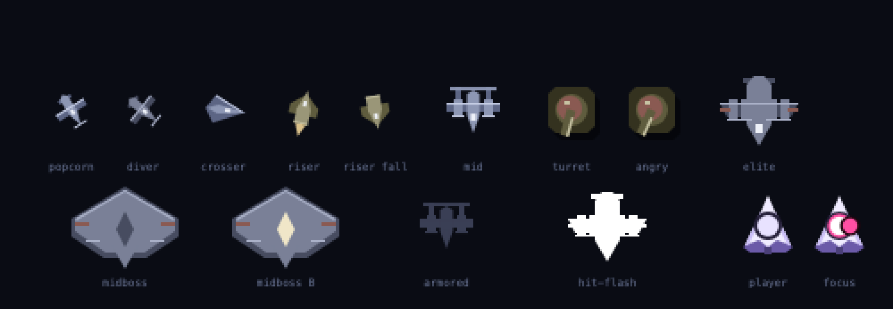

# SPEEDHELL — Design Wiki

*How the game's systems actually work and why they were built that way. Written for
three readers: Jacob coming back after a break, a future Claude session, and outside
eyes (Mark MSX, boghog). Every number here is read from the code, not remembered;
file:line pointers are to `src/core/`. Where a decision is contested or unresolved,
it says so — the "Open questions" section is the part to send to a critic.*

*Companion docs: `DESIGN_PILLARS.md` (the constitution), `HOMAGE_STUDY.md` (the
lineage laws), `BOGHOG_CRAFT.md` (craft notes), `CRITIC_RUBRIC.md` (the referee's
acceptance criteria), and `research/` (the deep-research corpus: canon fire-
gating/density/ground-layer, hitbox display, playtest interviewing, ZeroRanger —
see `research/README.md` for the roadmap state). This wiki is the explainer
that sits underneath them.*

Last updated: 2026-09-01 (r28: Booth recorder divergence root-caused — renderer shake leaked g.rng; fixed to fxRng. Reds = midboss bot-priority question only).

---

## 1. The game in one paragraph

One stage, ~1.5–2 minutes for an expert, ~4–5 for a practiced human. A 320×427
field, fixed 60Hz, seeded deterministic logic (the same seed and inputs always
produce the same run — this is what makes the bot referee possible). Eight
sections: popcorn intro → turret alley → mid gauntlet → midboss → rush → elite
pair → release → 3-phase boss. You have 3 lives and 2 bombs; a death restores
bombs to 2. Score is the only progression. There is no rank, no difficulty
menu, no unlocks.

## 2. Scoring — "stopwatches, not run time"

### 2.1 The one rule

Every enemy starts a private stopwatch the moment it becomes **vulnerable**
(on-screen past y=16, 30 frames old, and past any spawn armor — `game.js:372`).
Kill it before its window expires and it pays **double** and adds one to the
chain. Miss the window by a frame and it pays base and the chain resets to 0.
That is the entire core. There is no multiplier, no rank, no combo bonus
stacked on top. (`killEnemy`, `game.js:220`)

Why binary: Pillar 2 and boghog WS06 — a quick-kill bonus must be a *visible
state* (SPEED or not), never opaque frame math the player can't perceive.

### 2.2 The table (`stage.js:21`, `ENEMY_DEFS`)

| Enemy | Count/stage | HP | Base | Speed-kill | Window |
|---|---|---|---|---|---|
| Zako (popcorn) | 80 + 32 traffic (r19 crossers/risers) + ~6 midboss escort | 2 | 200 | 400 | 75f · 1.25s |
| Turret | 12 | 24 | 500 | 1,000 | 150f · 2.5s |
| Mid | 4 | 44 | 800 | 1,600 | 210f · 3.5s |
| Elite | 2 | 134 | 3,000 | 6,000 | 380f · 6.3s |
| Midboss | 1 | 130 | 8,000 | 16,000 | 700f · 11.7s |
| Boss sub-part | 5 across 3 phases | 24 (P2 node: 56) | 1,000 | 2,000 | 300f · 5s |
| **Boss phase** | 3 | 110 / 134 / 135 | 12,000 | **24,000** | 600f · 10s |

Windows are sized from vulnerability, which begins during entry — a mid or elite
spends ~90–110 frames descending *inside* its window. Generous on popcorn, tight
on elites relative to their ~19s on-screen life.

Full-stage budget if every stopwatch is beaten: roughly **150k**. The boss alone
is ~72k of that — **half the game lives in three 10-second windows.**

### 2.3 Boss phase clocks are independent

Each phase has its own 10s clock starting when that phase's armor drops
(`scoreBossPhase`, `game.js:257`; `advanceBossPhase` resets `vulnAt`, gives a
60f armor beat while the next form telegraphs). Blowing P1's window does not
touch P2 or P3. A 12s/9s/9s boss still earns two of three.

Late-kill decay (r6, Psikyo-style "gold by kill time"): a phase pays full base
through 1,200f (20s), then fades linearly to ~0 at the 1,450f (24.2s) timeout
(`game.js:265`). Grinding a phase down at the buzzer pays like the timeout it
almost was. A timed-out phase pays nothing, cancels nothing, and leaves its
bullets on screen. The item shower on a phase kill shrinks with the same fade.

### 2.4 Garnish (deliberately subordinate to the core — "S6")

- **Chain** — HUD `CHAIN n` counts consecutive speed kills. It is *not* a
  multiplier. Every 5th speed kill spawns a "rush shower": 6 items worth
  `chain × 20` each (chain 20 → 2,400). Resets to 0 on any non-speed kill or death.
- **Items** — midboss kill: 8 × 800 (6,400). Boss phase kill: up to 10 × 1,000.
  S7 release: 14 × 150 (routing signage, not a payday). Items fall and are lost
  off the bottom; magnet radius 53px, collect radius 12px (`game.js` item loop).
  Rendered Blue Revolver-sized (r16): radius scales with value —
  `min(12, 7 + val/150)` px, so a 150 release coin draws at 8 and an 800/1000
  coin caps at 12 (old flat size was 6) — plus a slow deterministic glint pulse
  (`renderer.js` items block; phase seeded per-coin in `spawnItem`, no rng).
  Size-communicates-value, Psikyo small/large-coin style; safe to grow because
  items render below enemies/fx/bullets so gold can never mask a threat (S2).
  Collect radius intentionally NOT grown yet — open question below.
- **Bullet cancels** — bullets convert to points at a per-bullet rate: 30 on an
  elite kill (LOCAL, 90px radius — r11), bombs, and the S7 wall; 100 on a midboss
  **speed** kill (30 if late — r9, see §4.3); 100 full-screen on a boss phase
  kill. Mids cancel nothing (r11; they did full wipes before). The authored
  full-screen release moments are midboss, boss phases, S7, and bombs — only.
- **Bombs** — cancel at 30/bullet, 180f invulnerability, 90f cooldown. The panic
  button has a price: each unused bomb is 500 at the clear tally.
- **Clear tally** — `lives × 1,000 + bombs × 500` (`game.js:481`).

### 2.5 Caravan pull (`game.js:323`)

If the screen is empty, no gate is holding, and the next timeline event is >30
frames away, the stage clock runs 4×. Speed-killing a wave pulls the next one in
sooner (WS06 lineage). Never fast-forwards through the WARNING ritual.

### 2.6 Known legibility gap

Speed-kill popups say `SPEED`, not the doubled number; slow kills say `+800`.
The biggest scoring lever is the one the player never sees. Candidate fix:
`SPEED +1600`. Not yet done.

## 3. Enemy lifecycles — "dynamic lifecycle" (S4)

The house rule: a speed-killed enemy shows only its polite opening; an ignored
one escalates and owns the screen. Escalation is on a *behavior* clock separate
from the *scoring* window, so the two knobs can be tuned independently.

**Fire gating (r18, `stage.js` `mayFire`).** Three gates, and only three: an
enemy fires if it is (1) on-screen and vulnerable (y > 20, past spawn armor),
(2) not in the **bottom screen band** (y > H−60 — enemies past the player's band
go quiet: "the player typically can't shoot backwards", boghog WS04), and
(3) not **sealed** — no shot from inside 48px of the player (48px at needle
speed 3.3 ≈ 15f ≈ 240ms, above the rubric's 120ms reaction floor). The **boss
is never sealed** and ignores the bottom band. Before r18 the rule was "the
enemy must be 40px ABOVE the player", which no classic game has: it muted every
fire site — boss included — for a player parked at the top (Jacob's friend,
playtest 2026-08-29; referee: the old rule let a mortal top-parker clear the
boss arena with three timeouts, 0 bullet deaths, 8 bullets fired). Canon
sources: Yuge (Toaplan) on ground-enemy sealing; Toaplan's aim-anywhere vector
tests; Ikeda hunting safe spots; Psikyo bosses ridden at point-blank and still
firing. Point-blank on a turret is quiet (its reward) — nothing else is.

- **Zako** (`stage.js:72`) — one-volley popcorn. Every 3rd in a group is a
  shooter (one aimed prong on the way down); the diver variant homes briefly
  at 40–70f then commits with a short aimed fan. Soft walls steer them back
  inside the field so wall-hugging can't drag them off-screen. **r19 traffic
  variants** (`phase` 2/3): **crossers** enter from a side at the top band's
  height (y 38–58, x = 16 so the edge detector never trips), cross at 1.7px/f
  through the lanes where a top-parker or point-blanker stands, and dive at the
  far edge; a shooter fires one prong mid-crossing. **Risers** enter from the
  bottom on the rails (x 40 / W−40), climb slowly for 40f (a corner-hugger keeps
  ~16f before contact — S7), then fast to y 95, hang ~30f (the kill window —
  they can't be shot until they're above you), and fall back as popcorn; a
  shooter fires once from the apex. Placement: crossers in turret alley (both
  reps, opposite the popcorn side) and the mid gauntlet; risers in the rush (×2)
  and elite rep 2. Canon: boghog WS05 Top Line ("spawn enemies on opposite
  sides… keep the player mobile"); Garegga st.5/6 side entries, st.4 "ambush
  from below"; Gunvein's ships from the bottom. No rng.
- **Turret** (`stage.js:133`) — scrolls down at 0.47px/f from y −16/−40; goes
  "angry" at 4s on-screen (more fire, same scroll speed, so a lingering angry
  turret still clears on schedule). **r17 arrival shot:** its polite 3-needle fan
  (3/0.4/2.3 — the same sentence) now fires the frame it becomes vulnerable
  (y≈17), bypassing the top-edge gate; latched on `e.phase`. Since r18 it honours
  the 48px seal like every other shot — a point-blank arrival kill is quiet by
  canon, but the top is no longer silent (popcorn, mids, elites and the boss all
  fire at a top-parker now).
  Before r17 the first fan the mute allowed landed at age ~115 while a point-blank
  kill took 12f from vulnerability at age ~68 — and turrets that scrolled past
  *below* a top-camper could never fire at all. Probe (top camper at y 40–60,
  on-column): **zero enemy bullets in the whole alley, 4/4 speed kills at 7–9f,
  no deaths** → with r17: a non-dodging camper loses 2–4 lives; a sidestepping
  one keeps its speed kills (10–15f) and survives — the fast kill now costs a
  sidestep. S7 "no unavoidable deaths": the only spawn-adjacent spot with no path
  (on-column, y<35) is already a contact death when the turret passes.
- **Mid** (`stage.js:97`) — descends at 1.5px/f (mute for ~88–110f), fires one
  aimed 5-needle fan at age 65 (y≈86) on the way down (r10, see below), then holds
  deep (y 120–153), aimed fans every 80f, a spray at 230f; past 300f it parks and
  hoses. Exits (committed, never
  re-descends) at fireT > 560. *Note: the comment says it "exits before the
  midboss arrives"; mid #4 spawns at 2060 and exits around stage-frame 2710,
  after the midboss lands at ~2489. See §4.3 for why that matters.*
  **r10 entry shot (2026-08-27).** Playtest: the mute descent plus a 0.37s
  point-blank / 0.76s range kill meant a positioned human killed every mid in
  the silence — four free 800-point pinatas, and range play was already a safe
  kill (Pillar 2 inverted: no reason to close). Fix: one aimed fan at age 65,
  timed between a close kill (~age 55, earns the quiet) and a range kill
  (~age 77, eats the fan first). Same hp, same windows — a race, not a slog.
  Rejected: more hp (a grind). Dials in reserve: faster descent, overlapping
  mids. Caveat: the bots never killed mids in the silence anyway (expert: ages
  202–585), so the felt problem is human-only and the bot referee can't
  confirm the fix — Jacob's playtest is the test.
  **r11 (2026-08-29): mids no longer cancel on death.** Playtest: killing a mid
  full-wiped the screen — four wipes per gauntlet erased each next mid's entry
  fan and flattened tension into all-release. A one-column mid is not a
  space-controller; its fans now persist and stack (measured: mid-section avg
  bullets 59, max 127 for the reaction-delayed aggressive bot).
- **Elite** (`stage.js:138`) — descends 2.3s (mute until r11's entry signature:
  its laned arc wall now fires on the way down at age 70, so the pattern is FELT
  inside the speed-kill window — before, the rewarded fast kill skipped every
  pattern it had), parks deep (y 150), patrols the full width on the house tanh
  sweep, area-denial cycles escalating per 210f rep: rep 0 grindable, ring at
  rep 1, hose at rep 2, overstay tax at rep 3+. Killing an elite fires a LOCAL
  30/bullet cancel (90px, r11 — was full-screen): its denial field dies with it,
  the rest of the field's pressure stands. "Speed-kill = safety," locally."

## 4. The midboss

### 4.1 Fight (`stage.js:172`)

Descends to y=73, then sweeps rail-to-rail on the house tanh curve. Phase A
(hp > 45%): twin aimed fans every 70f, bendy streams every 130f; a leave-alive
hose starts at 780f. Phase B: rings every 130f + bounded spray; a desperation
layer past 950f. Times out at 1,400f (23.3s) — flees, no score, no cancel wall,
gate opens. "No milking" (S6).

### 4.2 The design question that came up (2026-08-27)

Playtest feel: a kill that detonates a full screen is a better moment than a kill
that pops an empty one. But with cancels at 100/bullet, the way to get a full
screen was to *wait* — which contradicts Pillar 2 (speed is the natural meta) and,
measured, was a trap anyway: farm-kill at ~20s ≈ 16,500 vs speed kill ≈ 19,500,
with a 0-point cliff at 23.3s. Worst of both: it read as a choice and wasn't.

Measured with the aggressive bot: bullets carried in from the previous wave are
gone within ~1s of the midboss going vulnerable (58 → 10 → 5 on one seed), so
"carry density in" doesn't happen naturally; the fight's own opening fire gave
the bot ~22–41 bullets to cancel at its ~5s kill.

### 4.3 Decision (r9): density comes from aggression

**r19 (overlap pass).** Two changes. (1) The midboss is **never sealed** — r18's
48px seal let a hugger mute the whole fight, bloom included; bosses don't seal
in the canon ("sealing only works on the weak"). Alone, this costs the expert
bot 448→653f on its midboss kill — still a speed kill. (2) **Escort:** the gate
freezes the timeline, so the fight was in a vacuum (Jacob: "way too easy to
speedkill… doesn't even feel like a challenging section"). After the bloom (it
still needs the clean screen), a crosser pair enters the top band every 150f
(alternating sides, y 36/52, one shooter) — Psikyo bosses spawn popcorn;
boghog: "one enemy that controls space + popcorn flying in". Measured (seed 1):
enemies on screen during the fight 1.3 → 2.5–3.0; the bots kill ~9 popcorn per
fight — and chase them: expert 653 → 912f, aggressive-human 743 → 1365f, both
outside the 700f window. Isolation shows the escort, not the unseal, does that;
the bot picks the nearest target above it, a human stays on the midboss. Bot
artifact or real cost — Jacob's playtest decides (§8.10).

1. **Arrival bloom** (`stage.js:180`) — once the screen holds only the midboss,
   it fires three slow, laned arc walls (13 bullets each at 1.0/1.25/1.5 px/f,
   center lane open, ~4.5s to drift off the field). A point-blank kill inside
   the bloom detonates it (measured: 30 → 40 → 55 bullets on screen through the
   bot's ~5s kill). A 10s kill sees it long gone. boghog line 29: "bullet cancels
   license near-unfair patterns (jump-scare → relief)." No rng in the bloom, so
   the referee's stream order is untouched. Waits for a clean screen because a
   straggler mid killed one frame after the bloom fired would cancel it for free
   (measured: 44 → 0 on seed C0FFEE) — the mid-exit timing note in §3 is why.
2. **Speed-gated cancel** (`game.js:245`) — the midboss's 100/bullet rate is a
   SPEED-kill property; a late kill cancels at 30 like every other wall. The
   milk route is dead by construction and the big `CANCEL +N` popup becomes a
   visible property of beating the clock.

Open feel check: three layered slow walls with a lane is the canonical readable
wall, but readability is a human judgment. Two walls (1.0/1.4) is the fallback.

## 5. The boss

### 5.1 Ritual (HOMAGE L3)

Scoreless sweep of stragglers + full scoreless cancel → ≥1s WARNING over an
empty field → 90f entrance with armor (wing pods deploy on the last beat) →
three forms, each a phase with its own silhouette, movement style, and bullet
dialect → clear tally 150f after the last phase.

### 5.2 Forms and dialects

- **P1 — winged form.** Rail hopper (see §5.4). Led/direct needle fans every 46f,
  accelerating lance volleys (the P1-only dialect, also carried by the two wing
  pods), laned arc walls at t=110 and t=200 whose lane is biased *toward* the
  boss's column — riding the lane is pursuit.
- **P2 — shed-armor form.** Flat full-width sweep. Pure twin spirals; the
  *only* aimed/led emitter is the single armor-node sub-part (56 hp), so killing
  the node strips P2 to spirals alone ("structure changes as you win," DDP).
- **P3 — bare core.** Same sweep, slower, plus a vertical breathing bob (±22px,
  ~8s). Desperation medley recombining only earlier signatures: P1's lances
  mirrored from both flanks (left direct, right led), P2's spirals, plus a
  radial ring beat. Two relay sub-parts fire aimed lances.

Escalation per 240f rep is super-linear past rep 3 — a "timeout-rider tax"
that only players stalling a phase ever meet. Killers resolve phases by rep 2–4.

### 5.3 Sub-parts (`stage.js:42`, `stage.js:201`)

Ride the hull at ±36–38px horizontally (outside its r=30 collision circle, so
they're hittable from below). Each hosts one of the phase's emitters — killing a
part *reduces the phase's output*, which is safety as well as score. They die
scorelessly when their phase ends, with no feedback. P1: 2 pods. P2: 1 node.
P3: 2 relays.

Priority rule: the doubled core (24k vs 12k) always beats a 2k part. Parts are
cheap (0.2–0.5s of point-blank fire) against a 10s phase window whose core kill
is ~1.1s of contact, so there is normally slack — but past ~7s into a phase
with the core up, abandon the remaining part.

Open: whether P3's 5s part window is honestly reachable against the sweep for
a human, or only for the bot. Unmeasured. A `LOST 1000` popup when a part
expires would at least make the side-bet visible (Pillar 2: the meta must be
authored *visibly*).

### 5.4 Movement, layer 1 — authored (per phase)

- **P1 rail hop.** Dwells on a rail 100px off center for 210f, then hops at
  4.2px/f (faster than the ship) to the rail on the **far side of the player**,
  never dwelling twice on the same rail. Reactive, not random. Damage happens
  in dwells; dwells demand pursuit. "Anti-camp from physics, not stats."
- **P2/P3 sweep.** `x = W/2 + tanh(3.5·sin(age·ω)) / tanh(3.5) · 100` — lingers
  at the rails, crosses the middle fast. ω = 0.006 (P2, ~17s period) / 0.005
  (P3, ~21s). Continuity governor caps motion at 4.4px/f. Parts ride the hull,
  so on P3 a relay traces the sweep plus the bob.

Lineage: the edge-dwell strafe is Psikyo (S1945II M7 walker, `study-s1945ii.md:111`)
and Raizing house style. The far-side hop has no direct precedent — it is a
house anti-camp idea.

### 5.5 Movement, layer 2 — the camp governor (`stage.js:378–460`)

Added r6.3 to defeat the *referee's* scripted probes (pinned campers, 2-spot
shufflers, machine crawlers, in-fire grinders) after they farmed the boss from
stillness. It is not from any shmup; every constant was tuned against bots.

Mechanism, in plain terms:
- A per-boss meter `campT` fills while the player is **still** (|Δx| < 0.7px/f)
  under the boss (gap < 48px) at 0.6/f; while parked waiting for delivery at
  1.5/f; while machine-crawling under it or shooting from inside its fire at
  1.5/f. It drains at 3/f while dodging (never for a flagged crawler).
- Over budget → the player's current x is **banned**: the boss treats a ±55px
  band around it as a wall and stays on the far side. Budgets ratchet
  55 → 25 → 12 → 6 → 2 per trip within a phase.
- Bans lift after ~50f of demonstrated *tracking* (near, moving, not in fire,
  not mid-transit); each refund in a phase costs 25 more credit. Damage dealt
  from inside fire ("grind hp" > 25) voids refunds for the phase.
- First trip from a cold start: ~1.5s of holding still under the boss.

Consequence for humans: parking in a part's column to line up a shot — the
natural thing a non-expert does — trips the governor, the boss slides away, and
the part goes with it. The player experiences "the boss moves randomly."

### 5.6 The contradiction worth a critic's eye

`HOMAGE_STUDY.md` L7 and `study-s1945ii.md:153, 215` say the optimal play against
the lineage's bosses is to **park point-blank underneath** ("max DPS beats max
safety"). The governor punishes that posture after 1.5s. Pillars 2 and 6 say the
game's rules must be legible; the governor is invisible state. The arcade answer
to camping was the bullets — aimed fire makes stillness lethal — and the P1 hop
plus led-aim volleys already do that here. Whether a meter tuned to beat bots
should be allowed to shape the boss at all is the open question (§8).

## 6. The player and the pipeline

`PLAYER` (`game.js:21`): speed 3.7, focus 2.3 (instant transition — twitchy,
speed-hell; boghog: "halving feels bad," ratio ~1.6), hit radius 3. Shots: 6 on
screen max, one every 3f, 3 dmg — ~57.6 dps at range, **120 dps point-blank**
because the cap only binds at range. This is the game's real risk/reward: range
play is a grind (elite ~2.3s), point-blank is the snappy kill (~1.1s). "The gap
is the felt content, not a stat multiplier" (S1).

### 6.2 Hitboxes and the display contract (r20)

*Written for outside eyes (Mark MSX, boghog): this is the collision model and
the exact promises the visuals make about it. Found and fixed across two Booth
playtest sessions, 2026-08-30. Full research: `~/Dev/claude-visualizations/
hitbox-display-report.md` (Touhou/CAVE/indie marker conventions, all cited).*

**The model.** Circle vs circle. Player hurtbox r = 3px at the ship's origin
(`PLAYER.hitR`); every enemy bullet carries r = 3px (uniform across rounds and
needles). A hit = centre distance < 6px. Same structure as modern Touhou
(player r 2–3 vs per-bullet circles).

**The display contract** — after r20, every visual statement about collision is
either exactly true or errs in the player's favour, never against:

- **The ship's dot is drawn at 6px — the full effective kill radius** (your 3 +
  the bullet's 3, foldable because bullet radius is uniform). Rule: *a bullet's
  centre touching your dot is a hit.* No smaller mark exists inside it. This
  follows the genre's one unanimous convention: the marker is never smaller
  than the truth — Touhou draws a 10×10 dot over a 3.3–7px hitbox, Mushihimesama
  a circle over "a few pixels" (research doc, verified). Before r20 the ship
  showed a growing pink centre SMALLER than the truth — the cheating direction,
  and the thing playtests called "hit when it feels like you should not have".
- **A bullet's WHITE part is the part that counts.** The white core of a round
  and the white centre of a needle are drawn at exactly the 3px hit circle;
  ring, rim, nose and tail are free graze area (Touhou's "the non-white border
  does not count", made literal). Jacob caught the pre-fix mismatch himself:

  

- **Focus feedback is a shape, not a colour** (WS02: colour-only changes die in
  peripheral vision — and in greyscale, which is the same test): focus whitens
  the dot and adds a pink rim. The old 6px dashed ring was information at an
  unreadable scale and is gone.
- **Sprites overstate enemies, never understate:** enemy sprites stay within
  ~1.2× their core hitbox; the ship sprite grew 18 → 28px around its unchanged
  3px core (was 3:1, now ≈4.7:1; Cave runs 8–10:1) so wing-clips read as the
  theatre they are.

**Verification tooling** (dev-only, served by the booth server):
`tools/hitbox-tester.html` — greyscale field where the ONLY colour is the two
red truth circles, with a 6× magnifier, adjustable bullet gates, slow motion,
and a 1px-nudge precision mode with live centre-distance readout; and
`tools/enemy-gallery.html` — every sprite at 4×.

**Deliberately NOT changed:** the collision numbers themselves. Shrinking the
bullet hit radius to the old visual core (3 → ~2) would make every dodge in
the game easier — a balance decision (and a full referee re-roll), parked
unless playtests ask for a more lenient game.

## 7. The referee (how "balanced" is decided)

`test/sim.mjs` runs the real core headlessly with scripted bots (expert,
aggressive, passive, blind, plus camp/stutter/tracker probes) and writes
`evidence/metrics.json`: an aggressive bot must outscore a passive one ≥3× and
see fewer bullets; passive play must face ≥1.6× the bullets; expert clears by
kills on six "robust" seeds with zero timeouts; camp probes must get zero boss
kills; frame time at max load ≤ 16.6ms; determinism byte-identical.

Two things a reader should know:
- **Referee metrics are sensitive to the rng stream.** Any change that alters
  when a bot fires or dodges changes which random numbers later sprays draw,
  and downstream seeds can flip. A red check is not automatically a regression —
  run HEAD as a control first (memory: `speedhell-rng-stream-fragility`).
- **As of 2026-08-27 the committed `metrics.json` is stale** (pre-r8-fx). HEAD
  itself fails `s6_alignment` (2.07 < 3), `s4_dynamic` (1.55 < 1.6), and
  `s7_robust` when re-run. Recert is a separate, Jacob-authorized referee
  commit; builders never edit `test/` or `CRITIC_RUBRIC.md`.

The bots define what "expert" means here. Jacob is not a 1CC-level player;
"the bot can do it" is evidence about the bot.

## 8. Open questions (send these)

1. **Is s4_dynamic's 1.6× bar still right?** It encodes the wipe-heavy world;
   r11 deliberately lets aggressive play coexist with more on-screen bullets.
   Referee recert decision.
2. **Camp governor vs point-blank lineage.** Should a behavioral meter tuned
   against bots shape boss movement, or should anti-camp live only in the
   bullets and the hop? If it stays, should it be *visible* (a meter, a tell)?
3. **P3 parts reach.** Is the 5s part window honest for a human against the
   sweep + bob, or a bot-only side-bet? Measure before tuning.
4. **SPEED popups hide the number.** Show `SPEED +1600`?
5. **Midboss bloom readability.** Three slow laned walls at arrival — fair, or
   a jump-scare that needs to be two?
6. **Mid #4 exit timing** overlaps the midboss gate, contradicting its own
   comment. Fix the timing or accept the overlap as content?
7. **Chain as a scoreboard.** The HUD's most prominent number is the least
   valuable one. Keep it (it's the *speed-kill streak*, which is the identity)
   or demote it?
8. **The suicide-for-bombs meta (accidental Garegga).** Discovered by Jacob in
   play (2026-08-29): bombs deal 30 dmg field-wide, so one bomb kills both boss
   side parts (24 hp) inside their window; bomb kills credit as speed kills
   (killEnemy is damage-source-agnostic), so bombs also insure the chain; death
   refills bombs to 2. The math: suiciding before the boss costs ~1,000 (one
   stock life, chain reset in empty air) and buys up to ~33,500 (parts 2,000×4
   + phase conversions 12,000×2 + cancel garnish) — optimal by 10–30×.
   **MSX verdict: keep as-is** — natural meta ("can you do it in the game?"),
   lives as convertible currency = Pillar 4 taken seriously, and it's Garegga's
   celebrated depth *without* Garegga's hidden-rank opacity (the trade is fully
   visible). **Boghog verdict: keep the move, fix the price** — the economy fell
   out of three unrelated decisions (mercy refill, garnish stock, bomb dmg
   tuning), and "balance = counters, not numbers": at 30× it's a dominant strat,
   not a decision. Candidate reprices: stock life 1,000→~5,000 (still ~3% of
   budget, S6 holds) or death refills 1 bomb, not 2. Both lenses bless the
   sub-mechanic (bomb kills = speed kills): bombs are scarce and priced; they
   patch a chain, they can't be one (102/104 still took ~100 honest speed
   kills). Tension with Pillar 2 (deliberate death becomes correct play) is the
   question to put to Mark directly. Decision: unresolved, unchanged in code —
   Jacob's call (leaning keep-as-discovered).
9. **The top of the screen is a silence zone (playtest, Jacob's friend,
   2026-08-29). PARTLY RESOLVED r18** — recommendations (1) and (2) shipped as
   the `mayFire` rewrite (§3 fire gating) and the boss exemption; (4) shipped as
   the `s6_topband` referee probe (four parks incl. the boss arena). Still open:
   (3) side/rear entries into the top band, and the boss top-lane swoop. Original
   text follows.** `mayFire` (`stage.js:66`) lets an enemy fire only when it is
   40px ABOVE the player, so a player parked at y≈16 mutes all 17 fire sites —
   including the boss (holds y≈92, r 30: no fire, no contact, and player shots
   can't reach below, so three timeouts clear the stage at ~0 boss score). r17
   patched the turret symptom; this is the disease. The referee is blind: every
   S6 camp probe fires from the bottom band. Corpora: MSX **entropy** ("you can
   set the controller down and break the game's logic" — explicitly opposed);
   boghog "checkmate from physical properties, not stats" [T3], "aimed forces
   movement" [T3], "ships from the bottom later" [T2]; Pillar 5 (top must be
   risky, not forbidden), Pillar 6 (fire from below in the existing needle
   language). **Four recommendations, logged for Jacob's decision, in order:**
   (1) replace the "40px above" rule with a distance floor (~48px, any
   direction; 48px at needle speed 3.3 ≈ 15f ≈ 240ms, above the S7 120ms
   floor) — un-mutes everything from the top; biggest referee event yet, and
   `bot.mjs` targeting uses the same skip (referee edit); (2) exempt the boss
   from any mute — it always fires, the camp governor owns position; (3) make
   the top band physically alive: side-entering popcorn crossing y 30–60 per
   section, later a bottom-entering diver group (Strikers / Star Soldier side
   and rear entries) — timeline-only, no stats; (4) add a top-band camp probe
   to the S6 referee set. Sequence: 1+2, playtest, then 3 (boghog
   pass-cooldown). Jacob has his own ideas from Strikers 1945 II, Star Soldier
   and DoDonPachi — not yet stated. Deep research on classic/Japanese
   bullet-hell targeting rules, enemy density and destructible environment
   commissioned the same day (Jacob: the original research "was insufficient
   — this should have been an obvious hole").
10. **The midboss is fought in a vacuum (Jacob, r18 playtest). SHIPPED r19 (escort + unseal, §4.3), playtest pending.** "Way too easy
    to speedkill… doesn't even feel like a challenging section." Nothing else is
    on screen during the fight, so the point-blank speed kill costs nothing.
    Options (no hp, per standing rule): (a) a popcorn stream that enters from
    the sides/bottom during the fight — Psikyo bosses spawn popcorn, boghog's
    "space controller + popcorn flying in"; the r9 bloom's clean-screen wait
    would need to tolerate popcorn; (b) let mid #4's exit overlap the arrival
    (the wiki §3 note already flags that timing) so the gate opens under fire;
    (c) both, sequenced. Referee: s7_pressure/s6 walls will move; the midboss
    speed-kill window (11.7s) stays. First target of the S3/D pass.
11. **Enemy visual identity (Booth session 1, 2026-08-30). FIRST PASS SHIPPED r20 (renderer-only), Booth playtest pending.** "All the enemies
    are grey geometrical shapes of similar sizes… everything just looks like
    grey, boring, geometric shapes." The r19 overlap works mechanically (replay:
    a clean speed-kill sweep of turret alley rep 1) but doesn't read as an
    encounter because nothing distinguishes popcorn, crossers and turrets. The
    S4 "desaturated silhouettes" rule exists so bullets keep top contrast
    (Pillar 6) — identity must come from shape, size hierarchy, motion and
    ground/air layering, not colour. Art pass; pairs with the G-pass scenery.
    Also from the session: the S1→S2 seam is a 2.5–3 s empty screen (flag 1)
    and the crossers' top-side entry "doesn't feel right" (flag 3). Debrief:
    `playtest/sessions/2026-08-30-booth-1.md`.

## 9. Practice notes (for humans)

- `sandbox.html`: presets spawn any enemy or the boss at P1/P2/P3 (P1 via preset
  has no pods — jump the timeline to 3900 for the real entrance). God mode and
  ∞ lives are on by default; `H` hitboxes, `L` labels (hp + remaining speed-kill
  window per enemy), time-scale, pause/frame-step.
- Never stop moving under the boss. Micro-dodge in its column; the governor
  counts that as engagement.
- Think stopwatches, not run time. Engage the instant something appears.
- Never leave items. Don't die, don't bomb unless it saves a life.

## Changelog of decisions recorded here

- 2026-08-27 — r9 midboss arrival bloom + speed-gated 100/bullet cancel.
  Decision: keep the full-screen detonation feel; source density from
  aggression, never from waiting. P3 parts: practice, not tuning, for now.
- 2026-08-27 — r10 mid entry shot (age 65 aimed fan). Decision: make the mid a
  race between closing and hanging back; never add hp. Referee red set moved from
  {s6, s4, s7_robust} at HEAD to {s7_pressure 23.2<24, s7_clearable expert P3
  timeout} — rng-stream drift, uncertified either way; recert pending.
- 2026-08-29 — r11 cancel scoping: mids no wall, elite local (90px), midboss/
  boss/S7/bomb walls unchanged; elite entry signature wall (age 70). Decision:
  full-screen release is reserved for authored moments; relief is scoped to what
  the dead enemy controlled. Referee: s7_pressure GREEN (23.2→32.2), s6/s7_
  clearable green; red = s4_dynamic 1.47<1.6 (mechanical: fewer wipes narrow the
  passive/aggressive bullet contrast — the check's bar encodes the old wipe-heavy
  world; recert question, flagged in §8) and s7_robust (5eed42 P1+P2 timeouts,
  stream drift).
- 2026-08-29 — r12 MOCK (playtest pending): mid's own voice. Entry fan replaced
  by an entry SPRAY (7 pink, lingering terrain); parked cycle = DOUBLE-TAP (two
  narrow 2-needle prongs 12f apart, second re-aims — tracks the dodge) alternating
  with a spray every 160f; leave-alive hose unchanged. Rationale: mid and turret
  fired the same aimedFan sentence; reserved dialects (lance/led/spiral=boss,
  bendy=midboss, laned wall=elite) forced a new voice from primitives. Measured:
  section avg bullets 32.5 (was 59 — fewer, deadlier: the human-like bot now
  loses a life in the section). Sprays draw rng → referee reshuffle expected.
- 2026-08-29 — r13 ramp (playtest: r12 still cleanly speed-killable): sprays at
  age 45 AND 85 (10 pinks, was one 7-spray at 65), parked cycle 160f→100f with
  the double-tap ~0.2s after park. Section avg bullets 59.7 / max 160 (r12:
  32.5/56); human-like bot loses a life. Speed kill still available, now earned
  inside the scatter. BUILD tag added to footer (r12→r13, src/version.js).
- 2026-08-29 — r14 midboss flip beat: phase B was hp-triggered but its patterns
  clock-triggered — at point-blank DPS act two lasted ~0.5s and could not fire
  (measured floor kill: 1.4s; bottom-lane 4.2s; window 11.7s). The 45% crossing
  now fires the B ring immediately (boghog T2 phase-bleed, T1 hp-as-duration,
  MSX expert bias). Verified: even the 1.4s kill meets the ring. Post-death
  scare attack (boghog T2) noted as optional, unbuilt.
- 2026-08-29 — r15 clear vacuum: boss killed → all items magnet to the ship at
  8px/f from any distance during the 150f pre-tally window (verified: 12 coins
  field-wide all collected). Cleared: homage L3 receipt, boghog loot-paid
  breathers, Psikyo/Cave stage-end auto-collect; MSX no-pushback (threat dead →
  no decision lost). Note: r15 coin-drops proposal (popcorn wave-end gold) is
  cleared-but-parked pending r13/r14 playtest settling (boghog pass-cooldown);
  this vacuum took the r15 build number.
- 2026-08-29 — r16 gold pickup presentation (Blue Revolver homage; built before
  r12–r15 landed from the parallel session, renumbered to avoid the r12 collision
  — it never carried a BUILD tag until r17): coin radius
  now scales with value (`min(12, 7 + val/150)`, was flat 6) + per-coin glint
  pulse. Renderer-only + a cosmetic `tw` phase field on the item struct (no rng,
  nothing in core reads it). Control run confirmed sim-invisible: gameplay
  metrics byte-identical with/without; red set unchanged {s4_dynamic, s7_robust}.
  Open: grow collect radius 12→~16 to match the new visual edge (Jacob's call;
  shifts score timing a few frames, needs sim numbers).
- 2026-08-29 — DECISION (consultation, no code): "hard mode with suicide bullets"
  → **loop 2**, not a menu mode. Pillar 3 ("one honest difficulty, no menu
  slider") + non-goals ("a second loop is the natural v2") forbid the toggle;
  HOMAGE L8 / S1945II adopt #10 already spec the loop as a bullet-diff — same
  stage, every kill (popcorn included, Psikyo precedent) spits slow aimed revenge
  dots, cancel-eligible. MSX: options-menu difficulty "subverts the intended
  difficulty curve through external factors"; loop 2 is earned in-credit (expert
  bias) and Garegga-flavored (speed-killing everything now fills the screen).
  Boghog: suicide bullets are the "just get paid" spam layer — slow, readable,
  macro-dodge, licensed by cancels; rejects mode bloat. Cotton "You Do!" claim
  from TV Tropes checked in-game by Jacob and NOT found — dropped. Cancel rate
  for revenge dots = scoring, Jacob's call. Loop-1 referee path untouched by
  design (`g.loop` flag); loop-2 cert is a separate question.
- 2026-08-29 — r17 turret arrival shot (see §3 Turret). Problem (Jacob playtest):
  "move to the top of the screen and kill all the turrets before they have a
  chance to shoot." Probe confirmed it's structural, not skill: a top camper saw
  0 bullets in the alley. Corpora: **boghog** — turrets are "kill fast or be
  blanketed" [T2] but his speed kill had a price (off-route); ours had none →
  "aimed forces movement" [T3], "balance = counters, not numbers" [T3] (no hp;
  rejected per standing condition), same entry-signature grammar as r10/r11.
  **MSX** — expert bias: the rewarded play must not be the trivial play (Pillar 2
  inverted); difficulty clarifies design — the alley was "in low contrast."
  **Rubric S7** no-unavoidable-deaths: argued in §3 (contact already owns the
  no-path spot); not sim-enforced today. Pushback noted: boghog "don't design
  around your own ideal route" — the bots never camped, so this is a human-only
  fix and Jacob's playtest is the test (same caveat as r10). Referee (control =
  same tree minus the one line): s7_pressure 34.2→28.7 aggressive (bar 24,
  green), s4_dynamic 1.69→1.97 (green, up), s7_clearable green; **s7_robust
  RED: one boss-P3 timeout on feedf00d**, all 6 seeds still clear with identical
  lives — stream drift (alley changes bot timing → later spray rng lands
  differently; boss is ~5,000 stage-frames downstream), same signature r11
  logged on 5eed42. Recert item, not a balance regression. No rng drawn.
  **Playtest verdict (Jacob, same day):** the free camp is gone but the alley
  "still feels too easy — a master/expert shmupper will tear through it no
  problemo." Accepted as-is for v1 / stage 1: it's the on-ramp, and expert
  pressure on this section is deferred to loop 2 (L8 revenge dots turn every
  tear-through kill into return fire). Dials in reserve if that changes: earlier
  arrival (fire at y≈0, before vulnerability), tighter pair timing (−40 spawn
  closer to −16), or arming the alley's popcorn too. No hp.
- 2026-08-29 — top-of-screen silence zone found in playtest (Jacob's friend);
  four recommendations logged as open question §8.9 (distance-floor mayFire,
  boss never muted, side/rear entries into the top band, top-band referee
  probe). No code. Deep research on classic/Japanese bullet hells commissioned:
  targeting/fire-gating rules, enemy density per stage, destructible
  environment — the three holes Jacob named after playing S1945II, Soldier
  Blade, DDP.
- 2026-08-29 — r18 fire gating: `mayFire` rewritten from "enemy must be 40px
  ABOVE the player" to the canon's three gates (on-screen; bottom screen band
  y > H−60; 48px seal), boss never sealed; the r17 arrival shot now honours the
  seal. Deep-research report (`~/Dev/claude-visualizations/shmup-canon-three-
  holes-report.md`) found no classic game gates fire by the player being above
  or beside an enemy. Corpora: **boghog** WS04 ("ground enemies will stop
  shooting if the player is close… a zone at the bottom of the screen where
  enemies will stop shooting since the player typically can't shoot backwards";
  the top is dangerous because "their collision hitboxes still make that area
  very dangerous" — WS05); **Toaplan/Yuge** (proximity seal "so people wouldn't
  think the game was unfair"; "tests to see whether the enemies could hit the
  ship at any given location on the screen"); **Ikeda** ("I do my best to find
  and remove [safe spots]"); **MSX** entropy ("consequence for the player being
  idle"); Pillar 5 (top risky, not forbidden), Pillar 6 (fire from below in the
  existing needle language — no new bullet family), rubric S7 reaction floor
  (48px ≈ 240ms). Pushback noted: canon seals GROUND enemies only; we seal all
  non-boss enemies because S7's floor demands it — air enemies at 20px would be
  unreactable. **Referee (Jacob-authorized edits: new `s6_topband` probe; the
  bot's 40px target filter is untouched — it picks what to shoot, and shots only
  travel up):** old rule → boss-arena top-parker CLEARED with 3 timeouts, 0
  bullet deaths, 8 bullets fired, score 0 (the friend's bug, reproduced); r18 →
  dies in 562f to 124 bullets. Stage top-parks: first bullet death 12.7s → 2.6s.
  Turret-alley camper (y 40, sidestepping): 24 → 369 bullets, 0 → 3 deaths.
  Expert bot BYTE-IDENTICAL (167,360, same deaths) — honest low play never
  touched the old mute. Aggressive-human: avgBullets 28.7 → 36.8, one new
  MIDBOSS timeout + one more death (the midboss now fires when hugged from
  beside/above — the first real balance signal, expected: aggression costs
  bullets now). **s4_dynamic RED 1.97 → 1.44 (bar 1.6)** — the passive/
  aggressive bullet contrast narrows because the aggressive bot takes fire it
  used to mute; §8.1 already asks whether that bar encodes the old world.
  Recert decision. s7_robust unchanged (feedf00d P3, pre-existing). s6_nocamp,
  s7_clearable, s7_pressure (36.8, bar 24) green. BUILD r17 → r18.
  **Playtest verdict (Jacob, same day):** (1) "top of the screen is not a safe
  zone anymore — you get shot in the ass"; (2) midboss: "we have work to do, but
  it's ok for now" — follow-up item, not a blocker; (3) turrets still easy when
  point-blanking and speed-killing — expected, it's the canon's seal reward, and
  the real fix is overlap (S3 top-band traffic + D-pass density), next; (4)
  needles from beside/below read fine (Pillar 6 holds). r18 pass settled.
  **Midboss (Jacob, after r18):** "way too easy to speedkill. With no
  overlapping enemies it's very boring — doesn't even feel like a challenging
  section." Diagnosis matches the research: the midboss is fought in a vacuum
  (mid #4 exits, nothing else is on screen — the r9 bloom waits for a clean
  screen by design), so the point-blank speed kill has no cost. The canon
  answer is overlap, not hp (standing rule): popcorn flying in during the fight
  (boghog WS05 "one enemy that controls space + popcorn flying in"; Psikyo
  bosses spawn popcorn — "procrastinate a boss fight to capitalize on the
  popcorn waves that appear regularly", 1cclog on Strikers 1945). Folded into
  the S3/D-pass plan as its first target; see §8.10.
- 2026-08-29 — r19 overlap pass (S3 of the canon report + §8.10): popcorn
  CROSSERS through the top band (turret alley ×2, mid gauntlet ×2, 5 each),
  RISERS from the bottom rails (rush ×2, elite rep 2, 4 each), a midboss
  ESCORT (crosser pair every 150f after the bloom), and the midboss removed
  from the seal (bosses never seal). +32 timeline popcorn (+~6 escort) →
  ~138 enemies, ~30/min (canon report: 60–190; this is the first step, the
  D-pass is the big one). Corpora: **boghog** WS05 Top Line ("break the top of
  the screen into lanes… spawn enemies on opposite sides"), WS05 "sequences of
  elite spawns get boring if not supported by smaller enemies like flying
  popcorn", Gunvein "ships fly up from the bottom"; **Garegga** st.4 ambush from
  below, st.5/6 side entries; **Psikyo** bosses spawn popcorn (1cclog S1945);
  **MSX** density/entropy; Pillars 1, 5; standing rule no-hp honoured. S7
  reaction floor for risers argued in §3 (40f slow start). G2 landmark turrets
  deferred — needs the hull set-piece. **Referee vs r18 control (no referee
  edits this pass):** s4_dynamic back to GREEN 1.44 → 1.89 (traffic reaches
  the passive bot), s5_edges 2 → 0, s7_pressure 30.6 (bar 24), s6_topband
  green; expert 100 → 128 kills, score 167,360 → 168,370, deaths 1 → 2; blind
  bot lasts 0.71 → 0.86m and scores 32k → 69k (more popcorn to farm — watch
  for the D-pass). **s7_robust red with a NEW cause:** 1234567 midboss timeout
  (the bot chases escort popcorn until the 1400f timeout), facade boss-p3
  (drift), feedf00d's old P3 timeout gone; lives 1 on three seeds. Midboss
  isolation (seed 1): unseal alone 448 → 653f (speed kill kept); escort alone
  → 912f (window missed) — bot target priority, see §4.3. Turret-alley camper
  y40: 316 bullets, 4 deaths. BUILD r18 → r19. Open for Jacob: (a) accept the
  escort and treat the bot's midboss chase as a referee-bot limitation (bot
  target-priority edit = referee edit), (b) thin the escort (every 200f, or
  one crosser instead of a pair), (c) escort only after the phase-B flip.
- 2026-08-30 — Booth session 1 (r19): first pause-and-talk playtest. Two flags,
  both replayed to the frame. Findings: (1) S1→S2 seam has a 2.5–3 s empty
  screen even with the caravan pull — Bored; the turret arrival landing on the
  music lift is a positive to protect; (2) turret alley overlap works
  mechanically but isn't cohesive because all enemies read as the same grey
  shape — enemy visual identity is the next hole (§8.11), crosser entry point
  secondary. Tooling: `booth.html`/`src/booth.js`/`tools/booth-server.mjs`/
  `tools/booth-replay.mjs`, `playtest/` (uncommitted). No code changes to the
  game this session.
- 2026-08-30 — r20 enemy identity art pass (§8.11; renderer-only, hitboxes
  and core untouched → referee unaffected by construction). Replaces the five
  flat grey polygons with two families and a size ladder: AIR — propeller
  fighter (popcorn), darker tilted diver twin, swept dart CROSSER flying
  sideways, stubby khaki RISER that climbs nose-up with exhaust and flips to
  fall, twin-boom MID that bobs while parked, four-engine bomber ELITE with
  rust wingtips, flying-wing MIDBOSS whose core goes pale on the phase-B flip;
  GROUND — TURRET on an octagonal plate with a drop shadow, khaki dome, a
  barrel that aims at the ship, rust when angry. All sprites nose-along-
  heading (rotate to velocity), two-tone shade/base/highlight, prop flicker.
  Palette stays desaturated (steel-blue air, olive ground, dark steel heavies)
  so pink/cyan/gold/violet remain bullets/items/player-only. Corpora:
  **boghog** WS02 ("values are the most important thing… colours still
  matter"; reserve bullet hues), WS04 ("enemies should react to getting hit…
  visible damage and destructible parts sell the feeling of interaction" — hit-
  flash kept); **Komazawa** ("the way tanks fire… every enemy and character in
  that game had a backstory"); **DDP** scale hierarchy ("big things are slow;
  fast things are small"); **Psikyo** WWII planes vs ground guns (S1945II
  study); Pillar 6 readable chaos honoured (enemies below bullets, no
  saturated colour). Gallery: tools/enemy-gallery.html (served by the booth
  server). Open after playtest: sprite detail at 2× canvas scale, whether the
  khaki riser reads as "from the ground", boss forms (untouched, already
  three silhouettes). BUILD r19 → r20.
- 2026-08-30 — r20 continued: Booth session 2 (three display lies + two bugs,
  all found by Jacob in play; debrief `playtest/sessions/2026-08-30-booth-2.md`).
  Fixed: popcorn nose now follows true flight (the core adds a sine wobble
  bigger than stored vx — renderer now adds the same term); midboss "teleport"
  at park (sweep ran off e.age ≈ 89 — now a 60f glide onto the same path;
  referee vs r19 control: s4_dynamic green 1.82, s6_alignment 2.81 vs bar 3 —
  RED, same recert class as §8.1; s7_robust swaps facade boss-p3 → midboss);
  WARNING now CUTS the stage track (was a 0.9s fade, audible under the siren);
  player ship redesigned 18 → 28px around the unchanged 3px core; hitbox
  display research commissioned and applied — ship dot drawn at the 6px
  effective radius, bullet white cores at their true 3px (see §6.2, with
  pictures). New dev tools: hitbox tester + enemy gallery. Corpora: boghog
  WS01 ("small hitboxes… much smaller than their sprites"; "tiny sizes can
  still be unintuitive to new players — find a balance"), WS02 value contrast;
  Touhou/CAVE/Blue Revolver marker conventions (hitbox-display-report.md);
  Significant Bits "players were less likely to feel cheated if they came out
  on the positive end". Open: shrink bullet hit radius 3 → ~2 (balance +
  referee, Jacob's call, parked); boss art to match the families (§8.11 scope).
  **Playtest verdict (Jacob, post-commit):** all four targets pass — "crossers
  and popcorn look different. midboss doesn't teleport. warning music is good.
  death feels earned." Overall: "feels OK" — the display/identity debts are
  paid; the remaining gap to *feels great* is the open density/pacing work
  (S1→S2 seam, crosser entry, D-pass), not polish. r20 settled.
- 2026-08-30 — research corpus moved into the repo (`docs/research/`, with
  raw per-pass findings and an index that carries the roadmap state) so any
  future agent can continue without this session's context. New: ZeroRanger
  deep-dive (`research/zeroranger.md`) — hue=threat/value=identity palette
  (adopt for the boss-art ramps), pattern-over-quantity density counterweight
  to the canon numbers (weigh in the D-pass shape decision), boss timer and
  overkill scoring candidates, save-wager refused (steal the stake shape only).
- 2026-08-30 — r21 seam pass (Booth session 1 flags, playtest pending): (1) the
  S1→S2 lull bridged with popcorn (5 at stageT 560, 4 at 645) — the turrets and
  their music-lift arrival are byte-identical (first vulnerability frame 690 in
  both builds); DDP grammar, "popcorn is mortar between bricks", and the felt
  problem was two parts: an empty gap the caravan pull only partly compresses
  plus ~1.4s of armored turret crawl — the bridge now overlaps both. Measured
  (expert bot, "nothing shootable" seconds across the seam): total 1.62s →
  0.83s, remaining = the crawl, now with live targets alongside. (2) Alley
  crossers enter mid-side at y 88 (Garegga side-tank height) instead of the top
  corner ("the top sides doesn't feel right"); mid-gauntlet crossers keep y 44
  so the Booth can compare heights. **Referee vs r20 control: s6_alignment
  recovered to GREEN (2.81 → 3.02) and s7_robust fully green for the first
  time since r18 (both midboss timeouts gone, facade 0L → 2L); s5_deadair
  expert max streak 1.1 → 0.8s; s7_pressure 38.0. s4_dynamic RED again (1.82 →
  1.49, bar 1.6)** — this bar has now flipped on four consecutive passes with
  every timeline change; recert question §8.1 is overdue. BUILD r20 → r21.
  **Playtest verdict (Jacob, 2026-08-31):** "feels ok enough. definitely very
  little lulls and downtime." r21 settled. His one report — "after killing the
  boss his laser kept flying at me and killed me" — replayed (run5, frame 3092)
  and decoded: not the boss (all phases were speed-killed and full-screen
  cancelled); it was the S6 ELITE kill — r11's LOCAL cancel leaves the elite's
  laned wall downfield, and the rep-2 turrets/risers fired after it died. Open
  question for Jacob: keep as the r11 price, or widen the elite cancel to its
  own bullets screen-wide.
- 2026-08-31 — r22 flee telegraph (Jacob's report, from an UNRECORDED run:
  "after killing the boss his laser kept flying at me and killed me"). Code
  audit: sub-parts die with the boss and a killed phase cancels full-screen —
  the only path leaving lances behind a vanished boss is the P3 TIMEOUT, whose
  despawn was silent and indistinguishable from a kill. The r6 scoring law is
  untouched ("pays nothing, cancels nothing, leaves its bullets"); the flee is
  now LEGIBLE: "FLED +0" popup + a fixed fan of departure streaks (spawnFx,
  zero rng) on boss-phase and midboss timeouts. addPopup exported for it.
  Referee: byte-identical to r21 across all four bots (scores/kills/deaths/
  timeouts equal); red set unchanged {s4_dynamic}. Booth lesson reinforced:
  the flag button exists because unrecorded memories decode slowly — the
  recorded elite death (see r21 entry) was a different, real finding (elite
  local-cancel question, still open). BUILD r21 → r22.
- 2026-08-31 — r23 grave-shot fix (Jacob, firmly: "I killed the boss and its
  blue laser stayed on screen and killed me"). Root cause found in the enemy
  loop: enemies UPDATE (fire) before the dead-sweep removes them, so a killed
  P3 boss got one more update tick and could emit a final lance volley AFTER
  its own kill's full-screen cancel — from beyond the grave, uncancellable
  (r22's timeout theory was wrong; apologies are in the transcript). Fixes:
  (1) dead enemies never update; (2) the guarantee Jacob asked for —
  `g.bossKilled` set on a killed final phase, and update() scorelessly sweeps
  any enemy bullet every frame until the tally (a TIMED-OUT boss's bullets
  still stay, r6 law untouched). Referee: byte-identical to r22 across all
  four bots and all six robust seeds; red set unchanged {s4_dynamic}. The
  bots never hit the one-frame window — human-only timing bug, three sessions
  of Booth flags to pin. BUILD r22 → r23.
- 2026-08-31 — r24 engageable-only caravan pull (Booth flag, r23 session: "if
  I don't kill all the popcorn enemies, I have to wait for them to fly off the
  screen before the mids arrive" — replay confirmed ~2.9s of waiting on
  stragglers below the ship). The pull's empty-screen gate now counts only
  ENGAGEABLE enemies — strictly above the ship, i.e. still hittable by
  upward-travelling shots; anything at or below the player can never be killed
  and no longer holds the timeline. §2.5 rule refined accordingly. Referee:
  identical to r23 on every measured number across all bots and robust seeds
  (bots kill everything above them, so certified paths never differed) — a
  human-facing fix, like r23. Red set unchanged {s4_dynamic}. BUILD r23 → r24.
- 2026-09-01 — r25/r26 experiment round (Jacob's explicit hp override, Booth
  session 2026-08-31): (1) MIDBOSS hp 130 → 400 — "adding the health to the
  midboss felt great… good call, we'll leave it for now"; point-blank kill
  ~1.1s → ~4–5s, phase B finally exists (boghog T1: boss HP is a
  pattern-duration knob). (2) ELITE rep escalation BUG fixed — `rep = e.phase`
  but nothing ever set an elite's phase, so the documented ring-at-rep-1 /
  hose-at-rep-2 never ran and elite #2 was a copy of #1 with 1.8s of silence
  per cycle (his "slight lull"). Elite #2 now genuinely rep 1. (3) Booth
  VARIANTS panel (r26): deterministic tune knobs in core (eliteHp / eliteEntry
  / eliteEscort / midbossHp, defaults = shipped values, referee never sets
  them), chips applied at run start only, every run/recording/flag stamped
  with its variant, replay honors the stamp — A/B/A comparisons are chip–R–
  play. Elite experiment chips wired (HP 220/280/340, side entry, escort);
  bottom-ambush deliberately not built (density-pass material). All knobs
  verified applied + deterministic in a bot clear.
  **REFEREE RED, decision needed (vs r24 control): the expert bot now TIMES
  OUT the 400hp midboss on the certified seed and all six robust seeds** —
  the bots chase escort popcorn (the r19 finding; 912f at 130hp) while Jacob
  kills it in ~4–5s. s7_clearable FAIL, s7_robust FAIL (6× midboss, +2 boss
  timeouts), s6_alignment 2.15 vs bar 3 FAIL; s4_dynamic 1.38 (chronic).
  Options, Jacob's call: (a) referee edit — give the bots boss/midboss target
  priority (the §4.3 option, now forced); (b) accept a red referee until the
  recert round; (c) revisit the hp (contradicts his verdict). The experiment
  stands as played; the referee question is now unavoidable. BUILD → r26.
- 2026-09-01 — TATE mode (Jacob: rotate the game output for a physically
  rotated monitor, "like most any other vertical shmup"): 90°/270° display
  rotation in the real game (T key cycles, persisted) and the Booth (panel
  button or ?tate). Pure display transform — the stick isn't bolted to the
  monitor, so physical-up is already game-up: no input remap (arcade cabinets
  rotate the monitor, not the stick). Booth also gained a portrait-desktop
  layout toggle (panel below the canvas). Tooling only; core untouched.
- 2026-09-01 — r27 elite verdict shipped (Booth variant testing, Jacob: "I like
  elite HP at 220 w/ side entry with escorts"): ENEMY_DEFS elite hp 134 → 220
  (range grind 2.4s → 3.9s, inside the 2.2–6s economy law), elite #1 enters
  from the flank at combat height, escort crosser pair every 150f during its
  fight. Booth chips flipped to ROLLBACKS (134 / top entry / no escort /
  midboss 130) so comparisons stay one chip away. Also this session: TATE
  mode + T binding, portrait layout. Referee vs r26: s5_edges 25f of side-entry
  exposure (bar 60) PASS, s1_economy PASS, s6_alignment 2.15 → 2.43 (closer,
  still under the 3 bar), expert lives 1 → 2, stray boss timeouts gone — every
  remaining red is the ONE pending decision: the expert bot times out the
  400hp midboss on all seeds (target-priority flaw; humans kill it in ~4–5s).
  §4.3 options stand: (a) bot priority referee edit, (b) live red until
  recert, (c) revisit hp. BUILD r26 → r27.
- 2026-09-01 — r28 Booth recorder divergence ROOT-CAUSED and fixed (handoff
  item 4; Jacob: "fix the divergence bug first"). draw()'s screen shake pulled
  TWO g.rng values per rendered frame (renderer.js:55, r8-era code — it predates
  the renderer's own "no g.rng in draw" rule). draw() only runs in the browser,
  so every live shake frame (bomb, elite/midboss kill, death) advanced the
  gameplay stream past what headless replay sees: live and replay played
  different games from the first shake on. Evidence: replay-sweep of all 119
  tapes → 54 diverged, the replay ghost ALWAYS dying earlier than the live run
  (the handicapped-ghost asymmetry was the tell); emulating the leak in the
  replayer (2 g.rng draws per post-update shake frame) made ALL four divergent
  r27 tapes and both tested r26 tapes replay byte-perfect to their recorded
  endings (20260901-141640 runs 2/4/5/8 → exact end tick, frame, state). The
  r25-exp tape (the original handoff exhibit) improves 2341 → 3573 but not to
  parity — it also carries pre-r26 build skew (no tune stamp). Fix: shake
  offsets now g.fxRng (the standing fx rule). Safety proof: draining fxRng
  every shake tick leaves end state byte-identical (fxRng feeds no gameplay
  branch); referee untouched (test/sim.mjs never imports the renderer;
  evidence/ not rerun). tools/booth-replay.mjs now warns on build-mismatched
  and pre-r28 tapes — pre-r28 recordings are HISTORICAL: their inputs answered
  the leaked-rng world and will never replay true. Deterministic replay is now
  trustworthy going forward — unblocks attract-mode / practice replays (polish
  phase) and restores the Booth's flag→replay→fix spine. Not a design change
  (no scoring/behavior/timeline delta); corpus clearance n/a — the fix
  IMPLEMENTS the existing fx-rng rule. BUILD r27 → r28.
