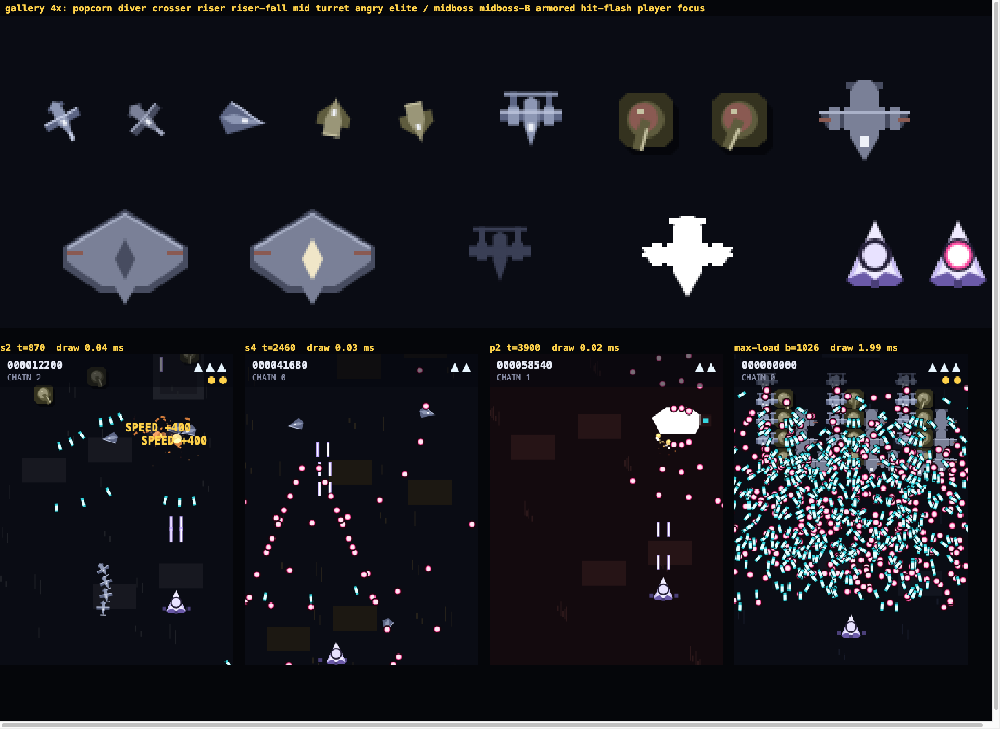
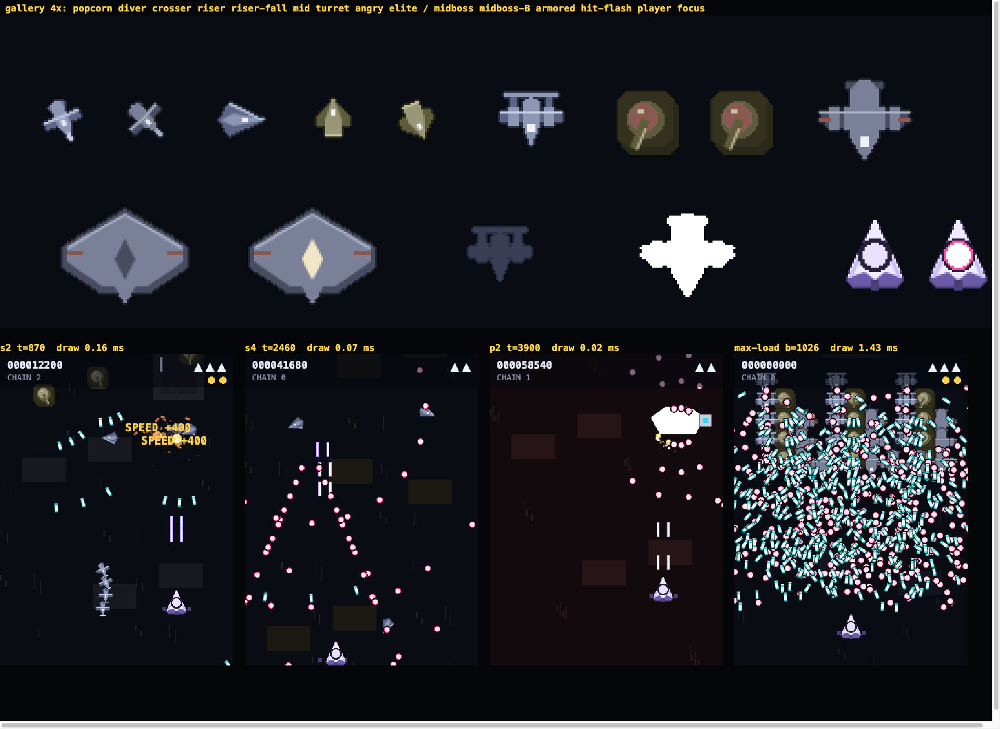
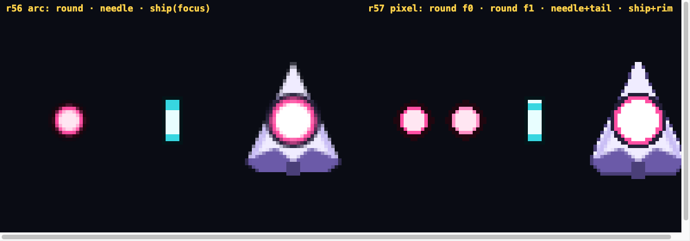

# Art Round 1 — pixel grid, palette, rims (r57)

*Builder brief per `docs/ART_BIBLE.md` §11. Branch `art/round-1`. Renderer-only:
`src/render/renderer.js`, `src/howto.js` (card now calls the renderer),
`tools/enemy-gallery.html`, `tools/artpeek.html` (new peek sheet). Core, hitboxes,
timeline, `g.rng`, sim and referee untouched.*

## Before / after

Sheet = enemy gallery at 4× (every sprite, variants, hit-flash, player, focus) over
the four stage moments the bible names (s2 turret alley, s4 midboss, s8 boss P2,
S8 max-load) at 1.4×, with a `draw()` time readout on each.

**r56 (main):**

**r57 (this round):**

Bullets and ship at 6×, arc (r56) vs pixel (r57):

Regenerate: `node tools/peek.mjs tools/artpeek.html out.png 1920x1400`.

## What changed (bible section → code)

| § | Rule | Done |
|---|---|---|
| 2.1 | integer sprite origins | every drawImage / trail / shot / popup / text rounds x,y; shake rounds too |
| 2.2 | integer geometry | the 2.5 / 3.5 / 1.5 vertices in popcorn, mid, turret barrel are integers |
| 2.3 | pixel discs | `disc()` span table (fractional r allowed) — items, turret dome, player dot, round bullets, HUD bombs; `arc()` remains only in `drawFx` (Round 5) |
| 2.4 | 16 heading steps | `stepOf()` on popcorn / mid / elite headings and the turret barrel. **Needles stay smooth** (see deviations) |
| 2.5 | no alpha on sprites | turret drop shadow → solid `GROUND.out` under-plate; sprite cache alpha-thresholds every edge |
| 3 | named palette | one block at the top: `AIR GROUND HEAVY SHIP ROUND NEEDLE ITEM UI BOSS`, exported as `PAL`; no hex literal below line 100 except the fx / section tables the bible lists "as tabled" |
| 4 | three tones + 1px rim | `sprite()` cache: paint → threshold → silhouette mask at the four offsets in the family `out` → body on top; hit-flash whitens the rim; ship gets dark rim + hull-light top edge |
| 5 | bullets | round = 2-frame pixel sprite at 5.6 / 4.2 / 3 (ring `#ff4fa3` ↔ `#ff8ec4`, held 4 ticks); needle + 1px bright tail tick; How-To card mirrors by calling the same functions |
| 6 | size ladder | unchanged (sprites within ~1.2r; rim adds 1px all round) |
| 11 | perf gate | max-load draw 1.99 → 1.43 ms headless (one drawImage per enemy instead of ~10 fills) |

## Open-question answers (bible §12)

1. **Pixel discs win.** At 3–6× the disc rim is a clean 1px ring; the arc version's
   rim smeared into the ring. Fractional radii keep the r20 sizes exact.
2. **16 steps shipped.** The stills can't show the popcorn wobble; that's a playtest
   call. 32 is a one-constant change (`STEP`).
3. **Cache is lazy** — keys are integers built from type × phase × side × step × prop ×
   hit × flick × extra; a full run makes a few hundred canvases ≤ 100 px. No eviction
   needed.
4. **Per-family `out`.** Global near-black was not tried; the per-family rims already
   separate AIR from GROUND from HEAVY at a glance in the gallery.

## Deviations from the bible (say where and why)

- **Needles keep smooth rotation** (§2.4 asks for 16 steps on rotation). An aimed
  needle's direction *is* its telegraph; 22.5° steps would misstate the aim by up
  to 11°. The needle's translate is snapped; only the rotation is free.
- **Boss hull is still r56's light grey** (`BOSS.hull`), not the HEAVY ramp the §3 table
  assigns it. Round 1 names before it retunes; the boss retune is Round 2's whole job.
- **Two non-bullet pinks stay:** the focus dot's 1px pink rim (wiki §6.2 contract) and
  the WARNING band. Both predate the bible and are flagged as UI uses in the palette block.
- **Mid bob is in screen-y**, not along the rotated axis as before (the mid is nearly
  always heading-0 when parked; invisible in practice).

## Not run

- `test/shots.mjs` and `test/sim.mjs` write into `evidence/` (referee-owned); not run.
  The sim doesn't import the renderer and the core diff is empty, so the certified
  metrics are unaffected. `test/shell.mjs` passes (How-To card, options, sound test).

## For the critics

Grade against bible §2–5 + rubric S2 / S3b / S4. Known soft spots to look at first:
hit-flash silhouettes grew 1px (rim goes white), the riser's exhaust plume is now
a rimmed shape, and the popcorn wobble at 16 steps in motion.
